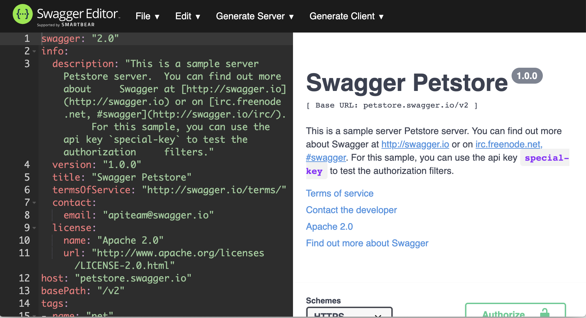

# View the A3S OAS3 Specification

This guide will assist a developer with viewing the A3S [OAS3](https://swagger.io/blog/news/whats-new-in-openapi-3-0/) specifications.

*Prerequisites*

This guide assumes that you have Docker installed, and that the A3S repository has been checked out. For more information, look at the [Quickstart guide](../quickstart/README.md).

## 1. Start Swagger Editor

Start the Swagger Editor docker container with the following command:

```bash
docker run -d -p 8080:8080 swaggerapi/swagger-editor
```

## 2. Open Swagger Editor

Launch the Swagger Editor on the following URL on your web browser:

    http://localhost:8080/

The default swagger Petstore API is displayed:



## 3. Import the A3S OAS3 specification file

Click on File -> Import File, and browse and select the A3S OAS3 spec file located at:

    {{a3s-source-folder}}/doc/a3s-openapi.yaml

The default swagger Petstore API is replaced by the A3S API definition:


## Conclusion

You are now able to view the entire A3S OAS API specification with each endpoint's usage and intent.

## Cleanup

Once you are finished, you can shut down the Swagger editor with the following commands (replace the container id with the one displayed for your instance):

```bash
$ docker container list
CONTAINER ID        IMAGE                       COMMAND                  CREATED             STATUS              PORTS                            NAMES
6a385c498c78        swaggerapi/swagger-editor   "sh /usr/share/nginx…"   58 minutes ago      Up 58 minutes       80/tcp, 0.0.0.0:8080->8080/tcp   boring_bell

$ docker container stop 6a385c498c78
6a385c498c78

$ docker container rm 6a385c498c78
6a385c498c78
```