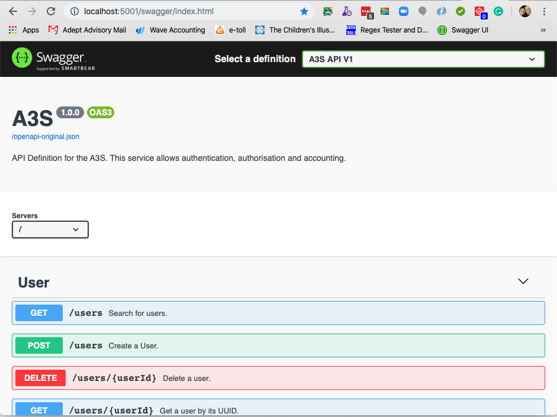
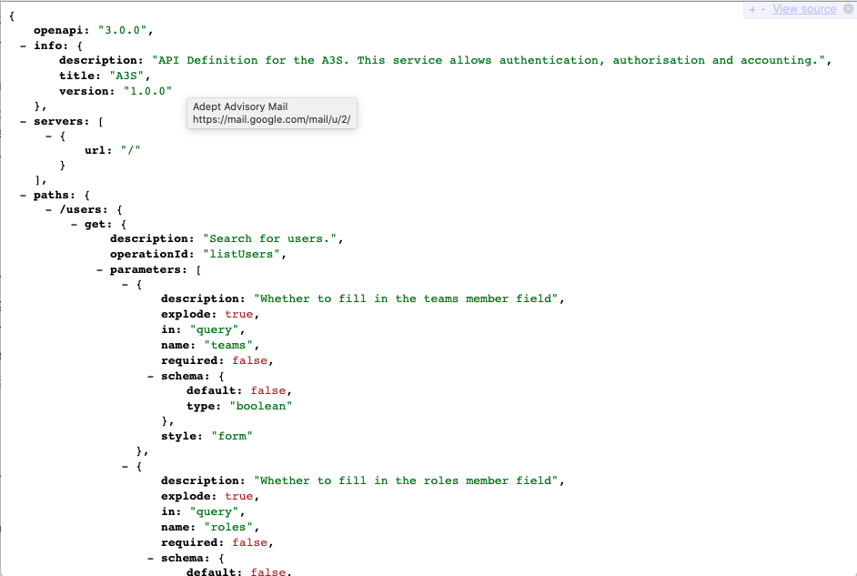

# View the A3S OAS3 Specification

This guide will assist a developer with viewing the A3S [OAS3](https://swagger.io/blog/news/whats-new-in-openapi-3-0/) specifications.

*Prerequisites*

This guide assumes that you have Docker installed, and that the A3S repository has been checked out. For more information, look at the [Quickstart guide](../quickstart/README.md).

## 1. Start the A3S Quickstart

Start the A3S quickstart:

```bash
cd A3S/quickstart

docker-compose up
```

## 2. Open Swagger UI

Launch the Swagger UI on the following URL on your web browser:

    http://localhost:8081/swagger

The A3S API is displayed:



## 3. Open Swagger JSON Specification

Optionally, you can also access the Swagger JSON specification at:

    http://localhost:8081/openapi-original.json

The A3S API is displayed:



## Conclusion

You are now able to view the entire A3S OAS API specification with each endpoint's usage and intent.

## Cleanup

To stop all the containers, simply type ctrl + c within the terminal that you ran docker-compose up in. This will terminate the environment, but preserve the state of the stack. To restore a previously terminated environment, simply run

docker-compose up
To completely clean up all trace of the environment, including any possible state, run

docker-compose down
within the ./docker-compose/quickstart folder.

